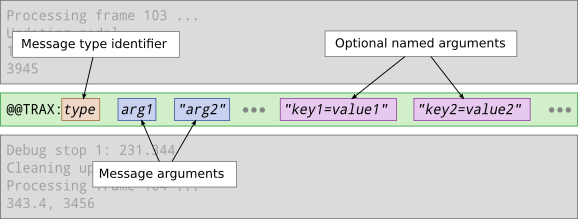
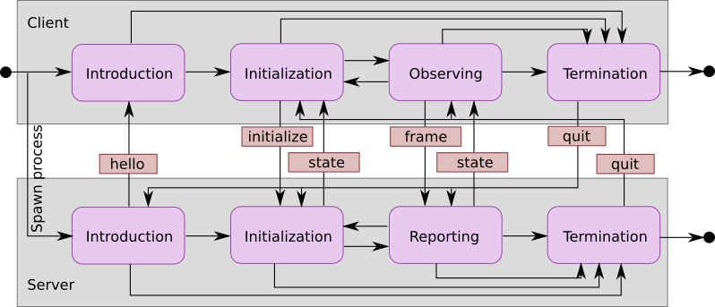
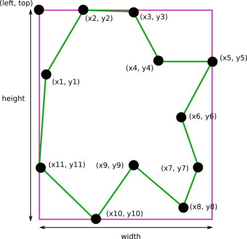

TraX protocol specification
===========================

The TraX protocol is designed with simplicity of integration in mind, but is also flexible enough to allow extensions and custom use-cases. The protocol is primarily based on the a mechanism that all modern operating systems provide and requires no additional dependencies - standard input and output streams of a process. However, other media, such as TCP streams can also be used, the main idea is that the protocol communication is embedded the communication between the tracker process and the control process in these streams. The communication is divided into line-based messages. Each message can be identified by a prefix that allows us to filter out tracker custom output from the protocol communication.

Definitions
-----------

We adopt the standard client-server terminology when describing the interaction, although the definition is a bit counterintuitive in some aspects. We define the basic terms of the protocol as:

 - **Server**:  A server is a tracker process that is providing tracking information to the client that is supplying the server with requests -- a sequence of images. Unlike traditional servers that are persistent processes that communicate with multiple clients, the server in our case is started by a single client and is only communicating with it.

 - **Client**: A client is a process that is initiating tracking requests as well as controlling the process. In most cases this would be an evaluation software that would aggregate tracking data for performance analysis, however, additional use-cases can be accommodated in this scheme.

 - **Message**: Server and client communicate with each other using messages. Each message begins in new line, is prefixed by an unique string and ends with the end of the line. Generic message structure is defined in `Message format`_ and types of messages are defined in `Protocol messages and states`_.

Message format
--------------

Individual message in the protocol is a line, which means that it is separated from the past and future stream content by the new line (EOL) character. The format of all client or server messages is the same. To distinguish between arbitrary program outputs and embedded TraX messages a prefix ``@@TRAX:`` is used. The prefix is followed immediately (without white space character) by the name of the message, which is then followed by space-separated arguments. The format is illustrated in figure below. The message header is followed by a number of mandatory message arguments. This number depends on the type of the message and on the runtime configuration. The mandatory arguments are then followed by a variable number of optional named arguments which consist of a key and a value part and can be used to communicate additional data.

Escape sequences
~~~~~~~~~~~~~~~~

All the arguments can contain spaces, however, they have to be enclosed by double-quote (``"``) symbols. If you want to use to use the same symbol inside the argument, it has to be prefixed by back-slash (``\``) symbol, i.e. you have to use an escape sequence. Similarly escape sequence is also used to denote a bach-slash character itself (written as ``\\``) and a newline symbol, which has to be replaced by the ``\n`` character sequence.

Named arguments
~~~~~~~~~~~~~~~

Named arguments consist of a key, followed by character (``=``) and an arbitrary value character sequence. The key sequence may only include alphanumerical characters, dot (``.``) and underscore (``_``) and has to be at most 64 characters long. If a key is not valid the remote party may reject the argument or terminate the connection because of an illegal message format.

Protocol messages and states
----------------------------

Below we list the valid messages of the protocol as well as the states of the client and server. Despite the apparent simplicity of the protocol its execution should be strict. An inappropriate or indecipherable message should result in immediate termination of connection in case of both parties.

 - ``hello`` (server): The message is sent by the server to introduce itself and list its capabilities. This message specifies no mandatory arguments, however, the server can report the capabilities using the optional named arguments. The official arguments, recognized by the first version of the protocol are:

  * ``trax.version`` (integer): Specifies the supported version of the protocol. If not present, version 1 is assumed.
  * ``trax.name`` (string): Specifies the name of the tracker. The name can be used by the client to verify that the correct algorithm is executed.
  * ``trax.identifier`` (string): Specifies the identifier of the current implementation. The identifier can be used to determine the version of the tracker.
  * ``trax.image`` (string): Specifies the supported image format. See Section `Image formats`_ for the list of supported formats. By default it is assumed that the tracker can accept file paths as image source.
  * ``trax.region`` (string): Specifies the supported region format. See Section `Region formats`_ for the list of supported formats. By default it is assumed that the tracker can accept rectangles as region specification. 
  * ``trax.channels`` (string, version 2+): Specifies support for multi-modal images. See Section `Image channels`_ for more information.

 - ``initialize`` (client): This message is sent by the client to initialize the tracker. The message contains the image data (for one or more images) and the region of the object. The actual format of the required arguments is determined by the image and region formats specified by the server.
 - ``frame`` (client): This message is sent by the client to request processing of a new image (or multiple images). The message contains the image data. The actual format of the required argument is determined by the image format specified by the server.
 - ``state`` (server): This message is used by the server to send the new region to the client. The message contains region data in arbitrary supported format (most commonly the same format that the server proposed in the introduction message).
 - ``quit`` (client, server): This message can be sent by both parties to terminate the session. The server process should exit after the message is sent or received. This message specifies no mandatory arguments.

The state diagram of server and client is defined by a simple automata, shown in figure below. The state changes upon receiving appropriate messages from the opposite party. The client state automata consists of the following states:

 - **Introduction**: The client waits for ``hello`` message from the server. In this message the server describes its capabilities that the client can accept and continue the conversation by moving to *initialization* state, or reject it and terminate the session by sending the ``quit`` message.
 - **Initialization**: The client sends a ``initialize`` message with the image and the object region data. Then the client moves to *observing* state.
 - **Observing**: The client waits for a message from the server. If the received message is ``state`` then the client processes the incoming state data and either moves to *initialization*, *termination* or stays in *observing* state. If the received message is ``quit`` then the client moves to *termination* state.
 - **Termination**: If initiated internally, the client sends the ``quit`` message. If the server does not terminate in a certain amount of time, the client can terminate the server process.

The server state automata consists of the following states:

 - **Introduction**: The server sends an introductory ``hello`` message where it optionally specifies its capabilities.
 - **Initialization**: The server waits for the ``initialize`` or ``quit`` message. In case of ``initialize`` message a tracker is initialized with the given data and the server moves to {\em reporting} state. The new state is reported back to the client with a ``state`` message. In case of the ``quit`` message the server moves to *termination* state.
 - **Reporting**: The server waits for the ``frame``, ``initialize``, or ``quit`` message. In case of {\tt frame} message the tracker is updated with the new image information and the new state is reported back to the client with a ``state`` message. In case of ``initialize`` message a tracker is initialized with the given data and the new state is reported back to the client with a ``state`` message. In case of the ``quit`` message the server moves to *termination* state.
 - **Termination**: If initiated internally, the server sends the ``quit`` message and then exits.

Region formats
--------------

The region can be encoded in two point-based formats. All two formats are comma-separated and illustrated graphically in figure below.

 - **Rectangle** (``rectangle``): The simplest form of region format is the axis-aligned bounding box. It is described using four values, ``left``, ``top``, ``width``, and ``height`` that are separated by commas. 

 - **Polygon** (``polygon``): A more complex and flexible region description that is specified by even number of at least six values, separated by commas that define points in the polygon (``x`` and ``y`` coordinates).

.. - **Binary mask** (``mask``): The most precise region description is a binary mask. The binary mask description starts with symbol ``mask:``

Image formats
-------------

The image can be encoded in a form of Uniform Resource Identifiers. Currently the protocol specifies support for four types of resources.

 - **File path** (``path``): Image is specified by an URL to an absolute path on a local file-system that points to a JPEG or PNG file. The server should take care of the loading of the image to the memory in this case. Some examples of image paths are ``file:///home/user/sequence/00001.jpg`` for Unix systems or ``file://c:/user/sequence/00001.jpg``.
 - **Memory** (``memory``): Raw image data encoded in an URI with scheme identifier {\tt image:}. The encoding header contains information about width, height, and the pixel format. The protocol specifies support for the following formats: single channel 8 or 16 bit intensity image (``gray8`` and ``gray16``) and 3 channel 8-bit RGB image (``rgb``). Note that the intensity format can also be used to encode infra-red or depth information. The header is followed by the raw image data row after row using Base64 encoding. An example first part of the data for a 320 x 240 RGB image is therefore ``image:320;240;rgb;...``.
 - **Data** (``data``): The image is encoded as a data URI using JPEG or PNG format and encoded using Base64 encoding. The server has to support decoding the image from the memory buffer directly. An example of the first part of such data is ``data:image/jpeg;base64;...``
 - **URL** (``url``): Image is specified by a general URL for the image resource which does not fall into any of the above categories. Tipically HTTP remote resources, such as ``http://example.com/sequence/0001.jpg``. 

Image channels
--------------

Version 2 of the protocol also specifies support for multi-modal images, encoded in multiple image planes. To use this feature, the server must sent the ``trax.channels`` argument in the introduction message. The content of this argument is a comma-separated list of channels that are required. Currently supported channels are:

    - **Visible light** (``color``): Image is in visible light spectrum, by default only this channel is available.

    - **Depth** (``depth``): Channel contains depth information, useful for RGBD data.

    - **Infra Red** (``ir``): Infra red information, useful for IR sequences or for RGB + IR seqences.

Upon receiving the intorduction, the client evaluates if it can provide the data in requested format. If it proceeds, each channel is sent to the server as one or more arguments, encoded as specified in Section `Image formats`_. The order of the images is always the same as the order of the identifier list elements. 
