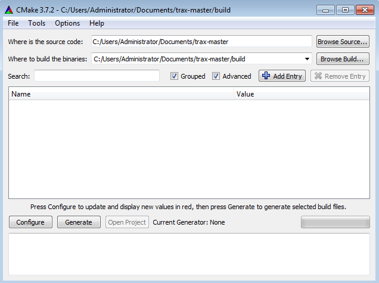
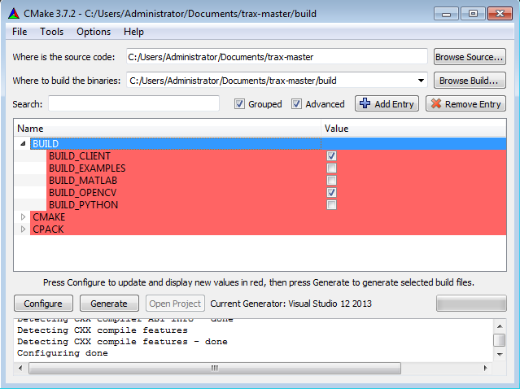

Compiling TraX library
======================

The TraX library and supporting modules are built using `CMake <https://cmake.org/>`_ build tool. If you have not used CMake before the best way to familiarize with it is by going through the `official tutorial <https://cmake.org/cmake-tutorial/>`_. CMake does not build the code by itself but generates build instructions for a given platform, e.g. Make on Unix systems, Visual Studio on Windows, and Xcode on OSX.

.. note:: In addition to CMake you will also have to install Python distutil if you want to build a Python package (although you do not have to do this to use the Python implementation) and Octave development packages if you want to build Octave-compatible MEX file (this can also be done from :doc:`within the Octave or Matlab console </tutorial_matlab>`).

If you want to build optional OpenCV support, you will have to install OpenCV library (together with development header files). Depending on your OpenCV installation location you may have to tell the CMake where to find the library.

Compiling using Make (Unix)
---------------------------

Building the project using Make tool is the typical for Unix systems (e.g. Linux and Max OSX). After installing all the dependencies and obtaining TraX source code you can open the terminal, go to the library source root directory and type the following commands::

    $ mkdir build
    $ cd build
    $ cmake ..
    $ make

With this you will create a subdirectory named `build` that will contain all the build artifacts, move to the directory, use CMake to generate build instructions and run Make to build the code.

.. note:: On Unix systems it is also possible to install the library and all public files directly from the build using `make install` command. The result of the command is system-depended but it will very likely install the library and other files in the `/usr/local` directory where they will be available to all users. While this kind of installation is not recommended it is a fast way of getting library available without having to manually configure search paths.

By default only the C library is built, if you want to enable additional modules you have to tell this to CMake by adding flags::

    $ cmake -DBUILD_OPENCV=ON -DBUILD_CLIENT=ON ..

This way both OpenCV module and client module will be built when running the Make command.

Compiling using Visual Studio (Windows)
---------------------------------------

On Windows CMake provides a GUI interface that can be used to generate a Visual Studio solution. Open the interface and set the source and build paths. According to the CMake best practices we perform build in a separate sub-directory to separate the generated binaries that can be safely removed and the source code. An example is shown in the screenshot of the interface below.

When configuring the project, first select the appropriate generator for you version of Visual Studio. After first generation stage, the variables table will be populated with default variable values. Optional modules, such as client support library or OpenCV extensions can be turned on using variables (OpenCV extensions will also require OpenCV 2.4 or higher to be available on the computer, you may have to tell CMake where to find it).

After the configuration stage is successful, you can generate Visual Studio solution, open it can compile the project by compiling the target `ALL_BUILD`. The compiled files will be available in either `Debug` or `Release` subdirectory of your build directory. Alternatively you can also compile target `INSTALL` to install the libraries to the folder, specified by variable `CMAKE_INSTALL_PREFIX` or targer `PACKAGE` to generate a ZIP archive of compiled artifacts.

