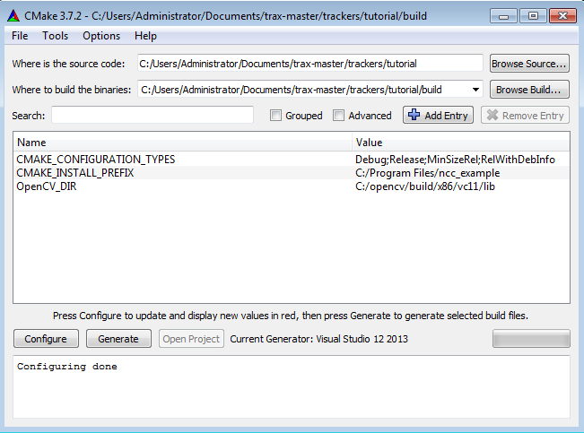

Using TraX on Windows
=====================

This tutorial will show you how to compile C and C++ trackers on Windows systems using CMake build system. It is assumed that you have read the :doc:`general remarks on tracker structure </tutorial_introduction>`.

This tutorial assumes that you are using Visual Studio 2012 or 2015 for your development and are reasonably familiar with Visual Studio in general. For other build systems and version of Visual Studio you have to :doc:`compile and install </tutorial_compiling>` the library before continuing with the second step of this tutorial.

Step 1: Downloading binaries
----------------------------

Prebuilt binaries are available `here <http://box.vicos.si/vot/trax/>`_. They are compiled using the `AppVeyor Continious Integration service <https://ci.appveyor.com/project/lukacu/trax>`_. The binaries are compiled for Visual Studio 2012 (32bit and 64bit versions, linked with OpenCV 2.4) and 2015 (64bit version, linked with OpenCV 3.1).

Download the appropriate archive and unzip it to the desired location. Then add path to the `bin` subdirectory of the extracted bundle to the `system PATH variable <https://en.wikipedia.org/wiki/PATH_(variable)#DOS.2C_OS.2F2.2C_and_Windows>`_ so that you will be able to use client tools and that programs will find the TraX dynamic library.

Step 2: Preparing your project
------------------------------

For the purposes of this tutorial we will use a simple NCC tracker that uses OpenCV library (because of this we will also use OpenCV support library to make integration easier and more general). The original source code for the tracker is available in the project repository in directory `docs\tutorials\tracker`. All the source code of the tracker is contained in a single file called `ncc.cpp`.

Inspect the source code to see that it is composed of three parts. The first one is the tracker implementation which contains the actual tracking algorithm. The second one contains utility functions that take care of loading the input data and writing the results. The final part contains the main tracking loop. Since this code is properly structured, all the adaptation work has to be done on this final part of the code. The initial tracking loop looks like:

.. code-block:: c++
  :linenos:

  int main( int argc, char** argv) {

    // Reading
    std::vector<std::string> images = readsequence("images.txt");
    cv::Rect initialization = readrectangle("region.txt");
    std::vector<std::Rect> output;

    NCCTracker tracker;

    // Initializing the tracker with first image
    cv::Mat image = cv::imread(images[0]);
    tracker.init(image, initialization);
    // Adding first output to maintain equal length of outputs and
    // input images.
    output.push_back(initialization);

    // The tracking loop, iterating through the rest of the sequence
    for (size_t i = 1; i < images.size(); i++) {

      cv::Mat image = cv::imread(images[i]);
      cv::Rect rect = tracker.update(image);
      output.push_back(rect);

    }

    // Writing the tracking result and exiting
    writerectangles("output.txt", output);

  }

To modify the source code to use the TraX protocol we have to remove explicit loading of the initialization data and let the protocol take care of this.

.. code-block:: c++
  :linenos:

  int main( int argc, char** argv) {

    NCCTracker tracker;

    trax::Server handle(trax::Metadata(TRAX_REGION_RECTANGLE, TRAX_IMAGE_PATH | 
                            TRAX_IMAGE_MEMORY | TRAX_IMAGE_BUFFER), trax_no_log);

    while (true) {

      trax::Image image;
      trax::Region region;
      trax::Properties properties;

      int tr = handle.wait(image, region, properties);
      if (tr == TRAX_INITIALIZE) {

        tracker.init(trax::image_to_mat(image), trax::region_to_rect(region));
        handle.reply(region, trax::Properties());

      } else if (tr == TRAX_FRAME) {

        cv::Rect result = tracker.update(image_to_mat(image));
        handle.reply(trax::rect_to_region(result), trax::Properties());

      }
      else break;
    }

  }

Lets now look at individual modifications. The creation `handle` object provides a protocol server handle that initializes the protocol and sends the introductory message. The handle is given protocol configuration structure that specifies what kind of data the server can handle as well as the optional output log that can be used for debugging::

    trax::Server handle(trax::Configuration(TRAX_IMAGE_PATH | TRAX_IMAGE_MEMORY |
                       TRAX_IMAGE_BUFFER, TRAX_REGION_RECTANGLE), trax_no_log);

When using OpenCV support library's function :cpp:func:`trax::image_to_mat`, the conversion from file path, raw memory and image buffer types happens automatically so supporting them all is really easy. Without this function you have to convert the image yourself.

The tracking loop has been modified to accept commands from the client. This happens with the call to the :cpp:func:`trax::Server::wait` function. The function populates the provided variables: new image, object state (on initialization), and optional parameters.

Since this kind of client-guided session means that the server does not know in advance how long will the tracking session be, the loop is only broken when a quit message is received from the client. The other two options are the initialization and new frame (which can always only follow successful initialization). The re-initialization can happen at any time throughout the session so the server should be capable of reinitializing the tracker (note that in untrusted setups the client may also terminate the session and start a new one).

Requests for initialization or update must be answered with a state message generated by :cpp:func:`trax::Server::reply`. This function accepts the object state as predicted by the tracker as well as any additional parameters that can be accumulated by the client for development or debugging purposes.

Because all the results are processed and stored by the client, we can remove the explicit results storage at the end of the loop. All these modifications also make all the utility functions in from the initial tracker implementation (second part of the source code) obsolete, they can be removed as their function is handled by the client.

Step 3: Compiling the project
-----------------------------

Finally we will modify the example's CMake file. Properly installed TraX library supports CMake discovery mechanism, the only line that we have to add is therefore::

    FIND_PACKAGE(trax REQUIRED COMPONENTS core opencv)
    TARGET_LINK_LIBRARIES(ncc_tracker ${TRAX_LIBRARIES})
    INCLUDE_DIRECTORIES(AFTER ${TRAX_INCLUDE_DIRS})
    LINK_DIRECTORIES(AFTER ${TRAX_LIBRARY_DIRS})

The project is compiled as a standard CMake project. First, we open CMake GUI tool, select the source and build directories as shown in the example below.

During the configuration phase we select the appropriate generator. In case CMake is unable to find TraX library automatically we have to set the `trax_DIR` variable manually (set the variable to the `share` subdirectory of the local TraX installation root since this is the directory where the CMake configuration files are stored). When there are no more configuration errors we can generate the Visual Studio solution in the build folder open it and compile the project.

.. figure:: images/ncc_cmake_trax.png
   :align: center
   :alt: CMake GUI interface after adding TraX library.

Step 4: Testing integration
---------------------------

A successful build results in a binary program (in this tutorial the program is called `ncc_tracker.exe` and is available in the `Debug` or `Release` subdirectory of your build directory). To test if the program correctly supports TraX protocol we can use the client `traxtest.exe` provided by the client support module of the project. This program tries to run the tracker on a sequence of static images to see if the protocol is correctly supported. Note that this test does not discover all the logical problems of the implementation as they may only occur during very specific conditions; it only tests the basic TraX compliance.

To run the test move to the build directory and type::

  $ traxtest.exe -d -- ncc_tracker.exe

If the integration is successful this command should output something like::

  CLIENT: Starting process  "ncc_tracker.exe"
  CLIENT: Setting up TraX with standard streams connection
  @@TRAX:hello "trax.image=path;memory;buffer;" "trax.region=rectangle;" "trax.version=1"
  CLIENT: Tracker process ID: 13019
  CLIENT: Connection with tracker established.
  @@TRAX:initialize "data:image/...
  Tracker initialized
  @@TRAX:state "130.0000,80.0000,70.0000,110.0000"
  @@TRAX:frame "data:image/...
  Tracker updated
  @@TRAX:state "130.0000,80.0000,70.0000,110.0000"
  @@TRAX:frame "data:image/@@TRAX:frame "data:image/...
  Tracker updated
  @@TRAX:state "130.0000,80.0000,70.0000,110.0000"
  @@TRAX:frame "data:image/...
  Tracker updated
  ...
  ...

